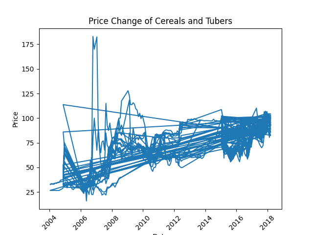
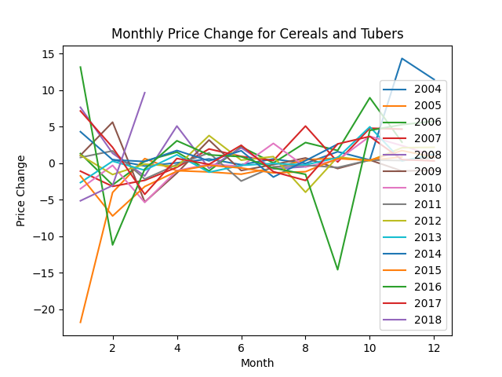

<h1>                                    Sri Lanka Food Price Report                                     </h1>
<h3>1 - How many different categories are there?</h3>

3

<h3>2 - What is the maxium and minimum dates in dataframe?</h3>
<table border="1" class="dataframe">
  <thead>
    <tr style="text-align: right;">
      <th></th>
      <th>max_date</th>
      <th>min_date</th>
    </tr>
  </thead>
  <tbody>
    <tr>
      <th>0</th>
      <td>2018-03-15</td>
      <td>2004-01-15</td>
    </tr>
  </tbody>
</table>
<h3>3 - How many records per year?</h3>
<table border="1" class="dataframe">
  <thead>
    <tr style="text-align: right;">
      <th></th>
      <th>year</th>
      <th>record_count</th>
    </tr>
  </thead>
  <tbody>
    <tr>
      <th>0</th>
      <td>2012</td>
      <td>149</td>
    </tr>
    <tr>
      <th>1</th>
      <td>2013</td>
      <td>57</td>
    </tr>
    <tr>
      <th>2</th>
      <td>2015</td>
      <td>606</td>
    </tr>
    <tr>
      <th>3</th>
      <td>2009</td>
      <td>153</td>
    </tr>
    <tr>
      <th>4</th>
      <td>2010</td>
      <td>179</td>
    </tr>
    <tr>
      <th>5</th>
      <td>2011</td>
      <td>222</td>
    </tr>
    <tr>
      <th>6</th>
      <td>2014</td>
      <td>45</td>
    </tr>
    <tr>
      <th>7</th>
      <td>2016</td>
      <td>650</td>
    </tr>
    <tr>
      <th>8</th>
      <td>2017</td>
      <td>1078</td>
    </tr>
    <tr>
      <th>9</th>
      <td>2018</td>
      <td>30</td>
    </tr>
    <tr>
      <th>10</th>
      <td>2004</td>
      <td>51</td>
    </tr>
    <tr>
      <th>11</th>
      <td>2006</td>
      <td>171</td>
    </tr>
    <tr>
      <th>12</th>
      <td>2007</td>
      <td>198</td>
    </tr>
    <tr>
      <th>13</th>
      <td>2008</td>
      <td>138</td>
    </tr>
    <tr>
      <th>14</th>
      <td>2005</td>
      <td>22</td>
    </tr>
  </tbody>
</table>
<h3>4 - Plot price change of category 'cereals and tubers'</h3>

<h3>5 - Plot monthly price change for the category 'cereals and tubers' for each year</h3>

